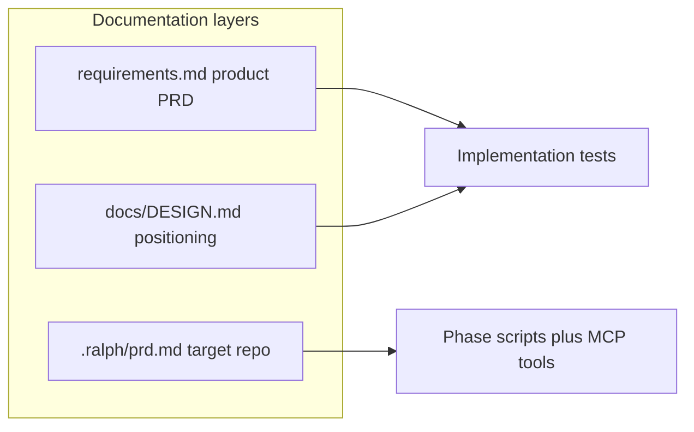

# MCP alignment, testing, and README refresh

## Alignment: requirements + DESIGN vs current codebase

**Overall: strong alignment.** The authoritative [requirements.md](requirements.md) (product PRD for this package) matches [docs/DESIGN.md](docs/DESIGN.md) on the core contract: stdio MCP only, `.ralph/` artifacts, Plan → Specs → Dev/QA phases, sandboxed paths, allowlisted verification, and bash/Copilot as the external engine. [ralph/task-status.json](ralph/task-status.json) tracks **meta loop work** (tasks 1–13 all `done`); it is **not** an MCP runtime artifact—DESIGN maps ralph-gui’s `task-status.json` to **target-repo** state expressed as `.ralph/fix_plan.md` + tools, which is consistent.

**Evidence of implementation coverage**

- **FR-01–FR-20 / NFR-01–NFR-08**: Implemented in [src/tools.ts](src/tools.ts), [src/workflow.ts](src/workflow.ts), [src/verification.ts](src/verification.ts), [src/index.ts](src/index.ts); granular tests exist across [tests/](tests/) (phase generators, `read_state`, task lifecycle, `replace_fix_plan`, exploration tools, `run_verification` with mocks, `validateRalphConfig`, logging, upsert guards, tool-name normalization, etc.).
- **DESIGN §4 (MCP boundaries)**: No in-process LLM, no HTTP server—matches code.
- **Personas**: [src/ralph-prompts.ts](src/ralph-prompts.ts) matches DESIGN Phase 1/2/3 descriptions.

**Minor gaps (documentation / clarity, not necessarily code)**

1. **README artifact path**: [README.md](README.md) lists `.ralph/phase3-feedback.md`, but [src/tools.ts](src/tools.ts) sets `FB="${SCRIPT_DIR}/logs/phase3-feedback.md"` → correct path is `**.ralph/logs/phase3-feedback.md`**.
2. **Two “requirements” concepts**: Root [requirements.md](requirements.md) is the **product** requirements for **ralph-loop-mcp**; DESIGN’s table refers to **target repo** SoT (`.ralph/prd.md` + plans). README should state that distinction so readers are not confused.
3. **Consumer repo scripts**: `ralph.run_verification` runs `ci` then `test:e2e` on the **host repo**; this package’s [package.json](package.json) does not define those scripts. That is acceptable (NFR targets the consumer), but README should say **the repo under `cwd` must define allowlisted scripts** (or verification will fail by design).
4. **Monorepo vs standalone README**: Current README uses `./mcp/ralph_loop_mcp` paths; this workspace is the package **root**. README should document **both** layouts (standalone clone vs embedded under a parent repo).

---

## Testing: happy path + “outside” conditions

**Today**: Tests call exported functions from `tools.ts` with `process.cwd` mocked—**no MCP wire protocol** is exercised. [requirements.md](requirements.md) NFR-08 says Vitest must pass; task 10 covered `normalizeToolName` in isolation, not full dispatch.

**Proposed additions**

### 1. Stdio MCP integration suite (real happy path)

- Add something like [tests/mcp_stdio.integration.test.ts](tests/mcp_stdio.integration.test.ts) (name can vary) that:
  - Spawns the built server: `node dist/index.js` with `cwd` set to a **temporary repo** containing minimal `package.json` (and, for later steps, `.ralph/` as created by generators).
  - Uses `**@modelcontextprotocol/sdk` client** over stdio (same package already in dependencies) to:
    - `**tools/list`** — assert expected tool names exist (spot-check full set against a single source of truth or a frozen list).
    - `**tools/call`** — minimal chain: e.g. `ralph.read_state` (empty/partial tree), then `ralph.generate_phase1`, assert key files exist under `.ralph/` and `.github/plans/`.
  - **Full Cycle E2E Test**: Add a test that executes a complete sequence on a dummy project:
    1. Setup a dummy repo with `package.json` (with dummy `ci` and `test:e2e` scripts that just `exit 0`).
    2. **Phase 1**: Call `ralph.generate_phase1`. Call `ralph.write_prd` with a dummy PRD.
    3. **Phase 2**: Call `ralph.generate_phase2`. Call `ralph.upsert_spec` with a dummy spec. Call `ralph.replace_fix_plan` with a dummy task.
    4. **Phase 3**: Call `ralph.generate_phase3`. Call `ralph.next_task` (returns the task). Call `ralph.run_verification` (passes). Call `ralph.set_task_status` to check it. Call `ralph.next_task` (returns null/no tasks).
    This validates the entire MCP surface area in a realistic sequence.

**Build dependency**: Integration tests need `dist/index.js`. Options: (a) `vitest` `globalSetup` runs `tsc` once, or (b) document `npm run build && npm test` in CI/README. Prefer **globalSetup** so local `npm test` is one command after clone.

### 2. Negative / edge cases (same transport)

Cover **outside** conditions without duplicating all unit tests:

| Scenario                                                | Expectation                                                                                |
| ------------------------------------------------------- | ------------------------------------------------------------------------------------------ |
| Unknown tool name via protocol                          | Error response / thrown path consistent with SDK (document expected behavior).             |
| `ralph.generate_phase3` when `fix_plan.md` missing      | JSON result with `ok: false` and error message (already unit-tested; assert via MCP call). |
| Invalid path on `write_plan` (outside `.github/plans/`) | Rejection surfaced through tool result.                                                    |
| `read_file` missing file                                | Structured `{ ok: false }` per FR-18.                                                      |

Reuse the same temp-repo + spawn pattern.

### 3. Scripts

- Add npm script e.g. `"test:integration"` if you want CI to run unit vs integration separately; otherwise keep a **single** `npm test` that runs unit + integration with clear `describe` blocks.

**Note**: True end-to-end `run_verification` invoking real `npm run ci` is slow and depends on consumer `package.json`; keep **mocked** `runNpmScript` tests as today, and optionally one **skipped-by-default** or **manual** test if you ever need a real npm gate.

---

## README updates (concrete edits)

1. **Intro**: Link to [requirements.md](requirements.md) (product SoT) and [docs/DESIGN.md](docs/DESIGN.md) (positioning + attribution).
2. **Prerequisites**: Node version (match `engines` if you add it, else “Node 20+”), npm, build before run.
3. **Install / build / run**:
  - **Standalone** (package root): `npm install`, `npm run build`, `node dist/index.js` or `ralph-loop-mcp` bin.
  - **Nested** (e.g. `mcp/ralph_loop_mcp`): show `--prefix` variant as optional.
4. **MCP host registration**: Cursor/VS Code JSON with `cwd` pointing at **target project** (the repo whose `.ralph/` is managed), not necessarily this package’s folder—clarify that distinction.
5. **Phases**: Keep Phase 1–3 sections; fix **phase3-feedback** path to `.ralph/logs/phase3-feedback.md`.
6. **Verification**: State that the **target repo** must define `ci` and `test:e2e` (or extend allowlist in `.ralph/config.json`) for `ralph.run_verification` to succeed.
7. **Testing**: `npm test`; mention integration tests and `build` prerequisite if using globalSetup; optional `test:integration` if split.
8. **Optional**: Add root `.gitignore` entry for `ralph/task-status.json` if that file should stay local-only (parallel to what you did in another repo).

---

## Suggested implementation order

1. Fix README factual errors (feedback path, dual layout, links, verification prereqs).
2. Add Vitest globalSetup (or documented build step) + `mcp_stdio.integration.test.ts` with ListTools + Phase1 generate chain.
3. Add full-cycle E2E test (Phase 1 -> 2 -> 3) on a dummy project via MCP stdio.
4. Add negative MCP cases in the same or sibling test file.
5. Optionally tighten DESIGN.md with one sentence: “Repository root `requirements.md` documents this MCP product; consumer repos use `.ralph/prd.md` as plan SoT.”

